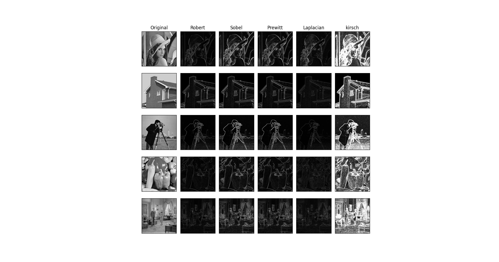

# Edge Detection

In this project, I program some edge detection algorithm, including Robert, Sobel, Prewitt, Laplacian and skirsch.
Besides, to evaluate edge detection algorithm, I relized PSNR and SSIM.
I chose five images for the experiment, which is in '.images/' dir.

Experiment result are as follow.
